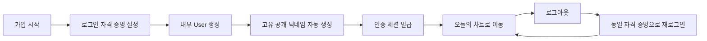
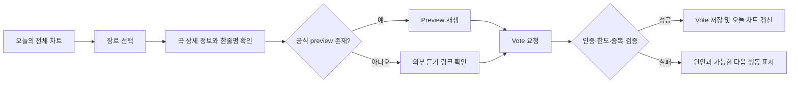
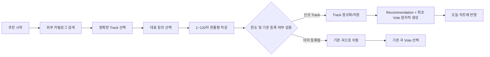
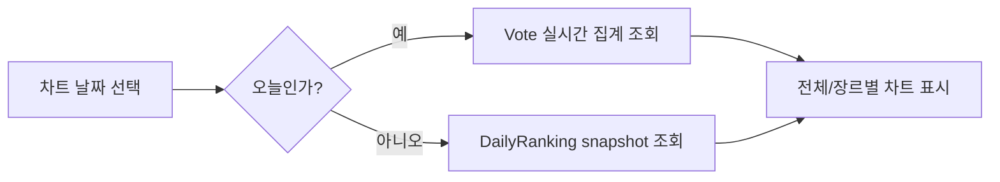
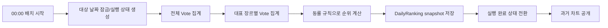
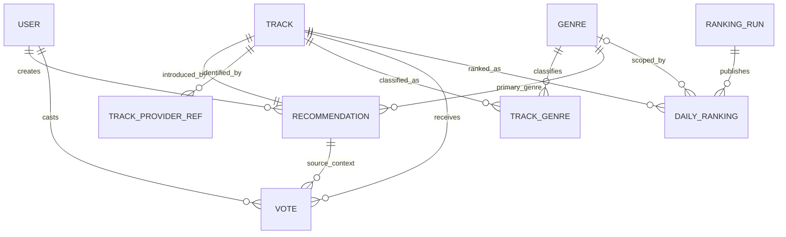

# Phase 1. MVP 요구사항, User Flow, Domain Model

> 상태: **Accepted**
>
> 확정일: 2026-08-11
>
> 이 문서의 권장안을 MVP 설계 기준선으로 사용한다.

## 1. 문서 목적

이 문서는 익명 사용자들의 일별 투표를 기반으로 장르별 음악 순위를 제공하는 커뮤니티형 Music Discovery Platform의 1차 MVP 범위를 정의한다.

이번 단계에서는 구현 기술이나 상세 컬럼을 확정하지 않는다. 대신 다음 단계인 화면 설계, ERD, REST API 명세가 같은 정책을 기준으로 진행될 수 있도록 기능 경계와 핵심 불변식을 정한다.

## 2. 이번 단계에서 결정해야 할 사항

1. 익명 사용자를 어떤 수준의 지속 가능한 계정으로 볼 것인가
2. 새로운 곡을 소개하는 `Recommendation`과 이미 소개된 곡을 지지하는 `Vote`를 어떻게 구분할 것인가
3. 신규 추천이 일일 권한을 소비하고 랭킹 득표로도 인정되는가
4. 중복 판단과 일일 사용량 제한의 기준 단위는 무엇인가
5. 오늘의 실시간 차트와 종료된 날짜의 확정 차트를 어떻게 구분할 것인가
6. 곡의 복수 장르와 추천 시 선택한 대표 장르를 어떻게 함께 표현할 것인가
7. 외부 음악 제공자에 종속되지 않도록 Track을 어떻게 식별할 것인가
8. 미리듣기나 외부 링크가 없는 곡을 어떻게 처리할 것인가

## 3. 추천 설계 요약

| 주제 | MVP 결정 |
| --- | --- |
| 사용자 | 개인정보를 받지 않는 영속 익명 계정. 내부 식별자와 로그인 자격 증명은 존재하고 공개 닉네임만 노출한다. |
| 일일 권한 | 사용자당 하루 5회. 운영 설정으로 변경 가능하게 하며 서버 시간대 기준으로 계산한다. |
| 신규 곡 소개 | `Recommendation` 생성으로 표현한다. 곡, 대표 장르, 한줄평, 최초 추천자를 보존한다. |
| 기존 곡 지지 | `Vote` 생성으로 표현한다. 사용자, 곡, 대표 장르, 투표 날짜를 보존한다. |
| 최초 추천의 표 | 신규 Recommendation과 추천자 본인의 첫 Vote를 하나의 트랜잭션으로 생성하며 일일 권한 1회를 소비한다. |
| 중복 방지 | 같은 사용자는 같은 날짜에 같은 Track에 한 번만 투표할 수 있다. DB Unique Constraint가 최종 방어선이다. |
| 곡 중복 | 내부 Track은 외부 provider ID와 ISRC를 이용해 정규화한다. 검색 결과는 선택만으로 저장하지 않고 실제 추천 시 저장한다. |
| 장르 | Track은 여러 Genre를 가질 수 있지만 Recommendation에는 차트 집계를 위한 대표 Genre 하나를 둔다. |
| 랭킹 | 오늘 차트는 Vote 실시간 집계, 종료된 날짜는 자정 배치로 만든 불변 `DailyRanking` snapshot을 조회한다. |
| 재생 | 서비스는 음원을 저장하지 않는다. 공식 preview가 있을 때만 재생하고 전체 곡은 외부 서비스 링크로 이동한다. |

### 선택 이유

- 신규 소개와 지지를 분리하면 최초 추천자의 한줄평을 보존하면서, 반복되는 사용자 반응은 작은 Vote 데이터로 안전하게 집계할 수 있다.
- 신규 추천을 첫 표로 처리하면 사용자가 같은 곡에 다시 투표해야 하는 어색한 흐름이 사라지고, 일일 제한 정책도 하나로 유지된다.
- 오늘 차트와 snapshot을 분리하면 실시간 탐색 경험과 과거 순위의 재현 가능성을 동시에 확보한다.
- 공개 닉네임과 내부 Identity를 분리하면 익명성을 유지하면서 중복 투표, 사용량 제한, 계정 연속성을 구현할 수 있다.
- 대표 장르를 Recommendation에 고정하면 복수 장르 Track도 장르 차트에서 중복 집계되지 않고, 최초 소개 당시의 맥락을 보존할 수 있다.

### 대안과 Trade-off

| 대안 | 장점 | 단점 및 MVP 판단 |
| --- | --- | --- |
| 비로그인 기기 쿠키만 사용 | 가입 과정이 거의 없다. | 쿠키 삭제와 기기 변경에 취약하고 어뷰징 통제가 약하다. MVP의 익명 계정 요구에 맞지 않는다. |
| Recommendation와 Vote를 하나의 테이블로 통합 | 초기 테이블 수가 줄어든다. | 최초 소개의 콘텐츠와 날짜별 반복 투표의 수명주기가 섞인다. 분리한다. |
| 동일 Track의 추천 게시물을 여러 개 허용 | 여러 사용자 의견을 보여주기 쉽다. | 표가 게시물별로 분산되고 대표 장르 충돌이 생긴다. MVP에서는 Track당 활성 Recommendation 하나를 권장한다. |
| 최초 추천은 표로 계산하지 않음 | 소개와 지지의 의미가 완전히 분리된다. | 신규 곡이 0표로 시작하고 추천자가 다시 투표해야 한다. 최초 Vote를 자동 생성한다. |
| 오늘 차트도 snapshot만 사용 | 조회가 단순하고 빠르다. | 오늘 들어온 반응을 볼 수 없다. 오늘은 실시간, 과거는 snapshot으로 분리한다. |
| 장르별로 동일 Track을 별도 추천 | 장르 커뮤니티별 맥락을 살릴 수 있다. | 중복 곡과 표 분산 처리 규칙이 복잡해진다. MVP 이후 검토한다. |
| Track에 Genre 하나만 저장 | 모델이 단순하다. | 실제 음악의 복수 장르를 표현할 수 없다. TrackGenre와 대표 Genre를 함께 사용한다. |

## 4. 용어 정의

| 용어 | 정의 |
| --- | --- |
| 익명 계정 | 내부 인증과 고유 ID는 있지만 개인정보 및 로그인 식별자가 공개되지 않는 계정 |
| Track | 서비스가 정규화하여 관리하는 하나의 음원. 앨범의 수록 위치나 외부 플랫폼 ID 자체와는 구분한다. |
| Recommendation | Track을 커뮤니티에 최초로 소개하며 대표 장르와 한줄평을 남긴 기록 |
| Vote | 특정 날짜에 사용자가 Track을 추천하고 싶다는 의사를 표시한 기록 |
| 일일 권한 | 하루 동안 신규 소개 또는 기존 Track 투표에 공통으로 사용할 수 있는 횟수 |
| Live Daily Chart | 아직 종료되지 않은 오늘의 Vote를 실시간 집계한 차트 |
| Daily Ranking | 종료된 날짜의 순위와 득표 수를 고정해 저장한 snapshot |
| 대표 장르 | Recommendation에 선택된 하나의 장르이며 해당 Track의 장르별 차트 집계 기준 |

## 5. Functional Requirements

우선순위는 `Must`, `Should`, `Could`로 표현한다. MVP 출시 조건은 모든 Must 충족이다.

### 5.1 익명 계정과 인증

| ID | 우선순위 | 요구사항 | 완료 기준 |
| --- | --- | --- | --- |
| FR-AUTH-01 | Must | 사용자는 개인정보 입력 없이 익명 계정을 만들 수 있다. | 계정 생성 후 내부 User ID와 자동 생성 공개 닉네임이 부여된다. |
| FR-AUTH-02 | Must | 사용자는 발급 또는 설정한 자격 증명으로 다시 로그인할 수 있다. | 로그아웃 후 동일 계정과 닉네임으로 로그인된다. |
| FR-AUTH-03 | Must | 다른 사용자에게는 공개 닉네임만 노출한다. | API와 화면에서 로그인 ID, 비밀번호 관련 값, 내부 보안 정보가 노출되지 않는다. |
| FR-AUTH-04 | Must | 닉네임은 충돌하지 않도록 생성한다. | 동시에 가입하더라도 동일 닉네임이 저장되지 않는다. |
| FR-AUTH-05 | Should | 사용자는 현재 남은 일일 권한을 확인할 수 있다. | 오늘 사용량과 총 한도가 추천/투표 화면에 표시된다. |

MVP 인증 정책 제안: 이메일 없이 `loginId + password`를 사용하고, `loginId`와 공개 닉네임을 분리한다. 비밀번호 분실 복구는 개인정보 수집 없이는 보장할 수 없으므로 MVP 범위 밖으로 둔다. 화면 설계 단계에서 복구 불가 안내와 자격 증명 보관 UX를 다룬다.

### 5.2 음악 탐색과 차트

| ID | 우선순위 | 요구사항 | 완료 기준 |
| --- | --- | --- | --- |
| FR-DISC-01 | Must | 사용자는 오늘의 전체 차트를 볼 수 있다. | 순위, 앨범 커버, 곡명, 아티스트, 대표 장르, 득표 수, 한줄평이 표시된다. |
| FR-DISC-02 | Must | 사용자는 장르를 선택해 오늘의 차트를 필터링할 수 있다. | 지원 장르별로 독립된 순위가 표시된다. |
| FR-DISC-03 | Must | 사용자는 종료된 날짜의 전체 및 장르별 차트를 볼 수 있다. | 날짜와 장르를 선택하면 저장된 snapshot을 조회한다. |
| FR-DISC-04 | Must | 순위가 동률이어도 결과 순서는 항상 동일한 규칙으로 결정된다. | 득표 수, 최초 추천 시각, Track ID 순으로 정렬해 재조회 결과가 변하지 않는다. |
| FR-DISC-05 | Should | 차트에 데이터가 없거나 일부 메타데이터가 없을 때 적절한 빈 상태를 제공한다. | 깨진 카드나 잘못된 순위를 표시하지 않는다. |

### 5.3 외부 음악 검색과 Track 정규화

| ID | 우선순위 | 요구사항 | 완료 기준 |
| --- | --- | --- | --- |
| FR-MUSIC-01 | Must | 인증 사용자는 외부 음악 카탈로그에서 곡명과 아티스트로 검색할 수 있다. | 검색 결과에 곡명, 아티스트, 앨범, 커버 등 식별에 필요한 정보가 표시된다. |
| FR-MUSIC-02 | Must | 사용자는 검색 결과 중 정확한 곡을 선택해야 한다. | 자유 입력 텍스트만으로 Recommendation을 만들 수 없다. |
| FR-MUSIC-03 | Must | 선택한 곡은 실제 추천을 확정할 때만 내부 Track으로 저장한다. | 검색만 수행한 결과는 서비스 DB에 누적되지 않는다. |
| FR-MUSIC-04 | Must | 같은 외부 곡을 반복 선택해도 내부 Track이 중복 생성되지 않는다. | provider와 external track ID 조합에 고유 제약이 적용된다. |
| FR-MUSIC-05 | Should | ISRC가 있으면 다른 provider의 동일 음원을 연결할 수 있도록 보존한다. | ISRC가 없더라도 provider ID로 저장 가능하며 추천 흐름이 중단되지 않는다. |
| FR-MUSIC-06 | Must | 외부 API가 실패하거나 응답이 늦을 때 사용자에게 재시도 가능한 오류를 표시한다. | 내부 오류 정보나 provider 비밀키는 노출하지 않는다. |

ISRC는 강한 중복 식별 힌트지만 모든 음원에 존재하지 않고 리마스터, 라이브, 지역판을 구분해야 할 수 있다. 따라서 MVP에서는 ISRC만을 전역 Unique로 강제하지 않고 provider ID의 고유성을 우선 보장한다. ISRC 기반 자동 병합 규칙은 실제 API 응답을 검증한 뒤 ERD 단계에서 확정한다.

### 5.4 Recommendation 생성

| ID | 우선순위 | 요구사항 | 완료 기준 |
| --- | --- | --- | --- |
| FR-REC-01 | Must | 인증 사용자는 검색 결과의 Track, 대표 장르, 한줄평으로 신규 Recommendation을 만들 수 있다. | 필수값 검증 후 Recommendation이 생성된다. |
| FR-REC-02 | Must | 한줄평은 공백만 입력할 수 없고 길이 제한을 적용한다. | MVP 권장값인 1~120자를 서버에서도 검증한다. |
| FR-REC-03 | Must | 신규 Recommendation 생성은 일일 권한 1회를 소비한다. | 한도를 모두 사용한 사용자는 생성할 수 없다. |
| FR-REC-04 | Must | 신규 Recommendation 생성 시 추천자의 Vote 한 건을 함께 생성한다. | Recommendation만 생성되거나 Vote만 생성되는 부분 성공이 없다. |
| FR-REC-05 | Must | 이미 커뮤니티에 등록된 Track은 신규 Recommendation으로 중복 등록되지 않는다. | 기존 Recommendation을 안내하고 기존 곡 투표 흐름으로 연결한다. |
| FR-REC-06 | Must | 대표 장르는 사전에 정의된 활성 Genre 중 하나여야 한다. | 임의 문자열 장르는 저장되지 않는다. |

### 5.5 Vote와 일일 권한

| ID | 우선순위 | 요구사항 | 완료 기준 |
| --- | --- | --- | --- |
| FR-VOTE-01 | Must | 인증 사용자는 등록된 Track에 오늘의 Vote를 할 수 있다. | 성공 시 오늘 차트 집계에 반영된다. |
| FR-VOTE-02 | Must | Recommendation 생성과 Vote는 합산해 사용자당 하루 5회로 제한한다. | 동시 요청이 발생해도 5회를 초과해 성공하지 않는다. |
| FR-VOTE-03 | Must | 같은 사용자는 같은 Track에 같은 날짜로 한 번만 Vote할 수 있다. | 중복 요청은 추가 표를 만들지 않고 명확한 도메인 오류를 반환한다. |
| FR-VOTE-04 | Must | 투표 날짜는 클라이언트가 아니라 서버가 서비스 시간대로 결정한다. | 클라이언트 시간 조작으로 날짜나 한도를 우회할 수 없다. |
| FR-VOTE-05 | Must | Vote 성공과 일일 사용량 반영은 원자적으로 처리한다. | 실패한 요청이 권한을 소비하거나 성공한 요청이 누락되지 않는다. |
| FR-VOTE-06 | Could | 사용자는 같은 날 자신이 남긴 Vote를 취소할 수 있다. | MVP 초기에는 제외한다. 취소 허용 시 snapshot 전까지만 가능하도록 별도 정책이 필요하다. |

일일 권한은 기본값 5회를 권장한다. 값 자체는 제품 실험 대상이므로 배포 없이 조정 가능한 서버 설정으로 둔다. 날짜 경계는 초기 서비스 대상에 맞춰 `Asia/Seoul`로 고정하고, 모든 저장 시각은 UTC instant로 보존한다.

자정에 가변 카운터를 0으로 되돌리는 작업은 하지 않는다. Vote가 `votedOn`을 가지므로 새 날짜의 사용량과 차트는 자연스럽게 별도 집계되고, 이전 날짜의 원장은 재집계와 감사에 사용할 수 있다.

### 5.6 Preview와 외부 듣기

| ID | 우선순위 | 요구사항 | 완료 기준 |
| --- | --- | --- | --- |
| FR-PLAY-01 | Must | provider가 공식 preview URL을 제공한 경우에만 사이트 안에서 재생할 수 있다. | 음원 파일을 다운로드, 변환, 재호스팅하지 않는다. |
| FR-PLAY-02 | Must | preview가 없는 곡도 추천과 투표가 가능하다. | 재생 버튼 대신 미리듣기 미제공 상태를 표시한다. |
| FR-PLAY-03 | Must | 제공 가능한 Spotify, Apple Music 등의 전체 듣기 링크를 표시한다. | 링크가 있는 서비스만 노출하고 새 외부 페이지로 이동한다. |
| FR-PLAY-04 | Should | 한 번에 하나의 preview만 재생한다. | 새 곡을 재생하면 기존 재생이 멈춘다. |

### 5.7 Daily Ranking snapshot

| ID | 우선순위 | 요구사항 | 완료 기준 |
| --- | --- | --- | --- |
| FR-RANK-01 | Must | 매일 00:00 이후 직전 날짜의 Vote를 전체 및 장르별로 집계한다. | 대상 날짜, scope, Track별 순위와 득표 수가 저장된다. |
| FR-RANK-02 | Must | 동일 날짜와 scope의 snapshot 생성은 여러 번 실행해도 중복 결과를 만들지 않는다. | 재실행 가능한 idempotent 작업으로 동작한다. |
| FR-RANK-03 | Must | 확정된 snapshot은 이후 Vote 변화와 무관하게 동일하게 조회된다. | 과거 차트 요청이 실시간 재집계를 수행하지 않는다. |
| FR-RANK-04 | Must | 배치 일부 실패 시 불완전한 날짜의 snapshot을 정상 완료로 노출하지 않는다. | 트랜잭션 또는 완료 상태로 원자적 공개를 보장한다. |
| FR-RANK-05 | Should | 운영자가 누락된 날짜를 안전하게 재집계할 수 있다. | 동일 집계 로직을 날짜 인자와 함께 수동 실행할 수 있다. |

## 6. Non-Functional Requirements

수치는 초기 MVP의 검증 가능한 목표이며 실제 부하 테스트 결과에 따라 조정한다.

| ID | 영역 | 요구사항 / 목표 |
| --- | --- | --- |
| NFR-01 | 보안 | 비밀번호는 검증된 단방향 해시 알고리즘으로 저장하고, 인증 실패 응답으로 계정 존재 여부를 과도하게 노출하지 않는다. |
| NFR-02 | 개인정보 | 이메일, 실명, 생년월일 등 서비스에 불필요한 개인정보를 수집하지 않는다. 공개 API는 내부 자격 증명을 반환하지 않는다. |
| NFR-03 | 권한 | Recommendation 및 Vote 쓰기 API는 인증 사용자만 호출할 수 있고, 사용자 ID는 인증 정보에서 결정한다. |
| NFR-04 | 데이터 무결성 | 중복 Vote, 중복 외부 Track, 닉네임 충돌은 애플리케이션 검사뿐 아니라 DB 고유 제약으로 방지한다. |
| NFR-05 | 동시성 | 같은 계정의 동시 요청과 인기 Track의 동시 투표에서도 일일 한도와 Vote 수가 정확해야 한다. 카운터의 읽기-수정-쓰기 방식은 사용하지 않는다. |
| NFR-06 | 성능 | 일반적인 차트 조회의 서버 처리 시간 p95는 캐시 없이 500ms 이하를 목표로 한다. 외부 API 검색은 별도 타임아웃 기준을 적용한다. |
| NFR-07 | 가용성 | 음악 검색 provider 장애가 로그인, 과거 차트 조회, 기존 곡 투표까지 연쇄적으로 막지 않아야 한다. |
| NFR-08 | 복구 가능성 | Ranking 배치는 idempotent해야 하며 특정 날짜를 재처리할 수 있어야 한다. |
| NFR-09 | 관측 가능성 | 인증 실패, 외부 API 오류율/지연, Vote 충돌, 배치 시작·완료·실패를 구조화 로그와 지표로 확인할 수 있어야 한다. 비밀값은 기록하지 않는다. |
| NFR-10 | 접근성 | 키보드만으로 주요 탐색, 검색, 추천, 투표, 재생 제어가 가능하고 상태를 색상만으로 전달하지 않는다. |
| NFR-11 | 반응형 UI | 최소 360px 모바일부터 데스크톱까지 주요 흐름에서 가로 스크롤이나 겹침이 없어야 한다. |
| NFR-12 | 호환성 | 최신 Chrome, Edge, Safari, Firefox의 최근 주요 버전을 지원 대상으로 한다. |
| NFR-13 | 시간 일관성 | 저장 시각은 UTC를 사용하고, 비즈니스 날짜 계산은 명시된 서비스 시간대 `Asia/Seoul`을 사용한다. |
| NFR-14 | 유지보수성 | 외부 music provider 응답을 내부 모델과 분리하여 provider 교체가 핵심 도메인 변경으로 이어지지 않게 한다. |
| NFR-15 | 테스트 | 일일 한도, 중복 Vote, 신규 추천의 원자성, 날짜 경계, ranking tie-break, 배치 재실행을 자동화 테스트로 검증한다. |

## 7. 핵심 User Flow

### UF-01. 익명 계정 생성과 재로그인

예외 흐름:

- 로그인 ID가 이미 존재하면 가입을 완료하지 않고 다른 ID 입력을 요청한다.
- 닉네임 충돌은 서버가 재생성하며 사용자에게 해결 책임을 넘기지 않는다.
- 잘못된 로그인 정보에는 ID와 비밀번호 중 어느 값이 틀렸는지 구분해 노출하지 않는다.

### UF-02. 오늘의 음악 탐색과 투표

주요 실패 사유는 미인증, 일일 5회 소진, 당일 동일 Track 투표 완료, 비활성 Recommendation이다.

### UF-03. 새로운 음악 추천

트랜잭션 경계는 Track 확보, Recommendation 생성, 최초 Vote 생성까지 포함한다. 외부 검색 호출은 긴 트랜잭션 밖에서 수행하고, 사용자가 최종 제출할 때 선택한 provider 식별자로 필요한 메타데이터를 재검증한다.

### UF-04. 과거 Daily Ranking 조회

아직 snapshot 생성이 완료되지 않은 과거 날짜는 실시간 집계로 조용히 대체하지 않는다. 미생성 상태를 표시하고 운영 재처리 대상으로 남겨 데이터 정의가 날짜마다 달라지는 문제를 막는다.

### UF-05. 자정 Ranking 확정

실패하면 완료 상태로 바꾸지 않으며, 같은 대상 날짜로 재실행해 기존 미완료 결과를 안전하게 교체할 수 있어야 한다.

## 8. Domain Model 제안

### 8.1 경계와 책임

| 도메인 영역 | 핵심 책임 |
| --- | --- |
| Identity | 익명 계정, 공개 닉네임, 인증 자격 증명, 계정 상태 관리 |
| Music Catalog | 외부 검색 결과를 내부 Track과 provider 참조로 정규화하고 Genre 메타데이터 관리 |
| Community Recommendation | Track 최초 소개, 대표 장르, 한줄평, 투표와 일일 권한 정책 관리 |
| Ranking | 오늘의 실시간 집계와 종료된 날짜의 snapshot 생성 및 조회 |

MVP는 단일 애플리케이션과 단일 관계형 DB로 구현하되, 위 영역을 패키지/모듈 경계로만 분리하는 모듈러 모놀리스를 권장한다.

### 8.2 개념 관계

### 8.3 Aggregate와 Entity 후보

#### User

- 내부 식별자
- 공개 익명 닉네임
- 로그인 식별자와 비밀번호 해시
- 계정 상태
- 생성/수정 시각

불변식:

- 공개 닉네임과 로그인 식별자는 각각 고유하다.
- 인증 정보는 외부 응답 모델에 포함되지 않는다.
- 일일 사용량은 파생 조회만 믿지 않고, 동시 요청에서도 한도를 강제할 수 있는 저장 모델을 ERD 단계에서 선택한다.

#### Track

- 내부 식별자
- 정규화된 곡명, 아티스트명, 앨범명, 앨범 이미지
- ISRC(선택)
- preview 정보(선택, 갱신 가능)
- 생성/수정 시각

Track은 외부 provider ID를 자신의 주 식별자로 사용하지 않는다. `TrackProviderRef`가 provider별 ID, 전체 듣기 URL, provider 메타데이터 갱신 시각을 담당한다. 이 분리는 한 Track을 여러 플랫폼에 연결하고 provider 변경 영향을 제한한다.

#### Genre / TrackGenre

- Genre는 서비스가 관리하는 제한된 분류 집합이다.
- TrackGenre는 Track의 복수 장르 메타데이터를 표현한다.
- Recommendation의 `primaryGenre`는 한 차트에 표를 귀속시키기 위한 단일 값이다.

#### Recommendation

- 추천자 User
- 대상 Track
- 대표 Genre
- 1~120자 한줄평
- 생성 시각과 상태

MVP 불변식:

- Track당 활성 Recommendation은 하나다.
- Recommendation의 대표 Genre는 해당 Track의 TrackGenre에도 포함되도록 같은 트랜잭션에서 보장한다.
- 생성 시 추천자 Vote가 함께 성공해야 한다.
- 한줄평 수정/삭제 정책은 MVP에서 제공하지 않는다. 운영상 숨김 상태는 별도로 둘 수 있다.

#### Vote

- 투표자 User
- 대상 Track
- 추천 맥락 Recommendation
- 집계 대상 대표 Genre
- 비즈니스 날짜(`votedOn`)
- 생성 시각

Vote에 Track과 대표 Genre를 보존하는 이유는 DB가 `(user_id, track_id, voted_on)` 고유 제약을 직접 강제하고, 추천 정보가 추후 운영상 수정되어도 과거 투표의 집계 맥락을 유지하기 위해서다. Recommendation과 중복되는 값의 일관성은 Vote 생성 서비스의 단일 트랜잭션 경계에서 검증한다.

핵심 고유 제약 후보:

- `UNIQUE(user_id, track_id, voted_on)`
- 일일 5회 제한은 Unique만으로 표현할 수 없으므로 별도의 `DailyVoteAllowance` 또는 User/date별 원자적 사용량 갱신을 ERD 단계에서 비교한다.

#### DailyRanking / RankingRun

DailyRanking은 다음 정보를 가진 불변 snapshot 항목이다.

- 대상 날짜
- scope: `ALL` 또는 `GENRE`
- Genre: scope가 `GENRE`일 때 필수
- Track
- 순위
- 확정 득표 수
- RankingRun

`RankingRun`은 대상 날짜, 상태(`RUNNING`, `COMPLETED`, `FAILED`), 시작/완료 시각, 실패 정보를 관리한다. 이를 통해 부분 생성된 snapshot을 노출하지 않고 재실행 이력을 설명할 수 있다.

핵심 고유 제약 후보:

- 전체 차트: `UNIQUE(ranking_date, scope, track_id)`
- 장르 차트: `UNIQUE(ranking_date, genre_id, track_id)`
- 실행: `UNIQUE(ranking_date)` 또는 재시도 이력을 별도 attempt로 분리

실제 nullable 컬럼과 고유 제약의 DB별 동작은 기술 스택과 DB를 정한 뒤 ERD에서 구체화한다.

### 8.4 핵심 도메인 불변식

1. 인증된 User만 Recommendation 또는 Vote를 만들 수 있다.
2. 신규 Recommendation과 최초 Vote는 모두 성공하거나 모두 실패한다.
3. 한 User의 Recommendation 생성과 Vote 성공 합계는 서비스 날짜당 5회를 넘지 않는다.
4. 한 User는 같은 서비스 날짜에 같은 Track에 한 번만 Vote할 수 있다.
5. Track당 활성 Recommendation은 하나만 존재한다.
6. Vote의 대표 Genre는 Vote 생성 시점 Recommendation의 대표 Genre와 같다.
7. 날짜는 서버가 `Asia/Seoul` 기준으로 결정하며 클라이언트 입력을 신뢰하지 않는다.
8. 완료된 DailyRanking snapshot은 일반 사용자 동작으로 변경되지 않는다.
9. Ranking 배치는 같은 날짜에 재실행해도 중복 snapshot을 만들지 않는다.
10. 외부 API 장애는 이미 저장된 Track 탐색과 Vote를 막지 않는다.

### 8.5 주요 명령과 조회 모델

도메인 동작은 다음 수준으로 구분할 수 있다. 이는 REST endpoint 이름이 아니라 이후 API 설계를 위한 행위 목록이다.

명령:

- 익명 계정 생성 / 로그인 / 로그아웃
- 외부 검색 결과로 신규 Recommendation 생성
- 기존 Track에 Vote 생성
- 대상 날짜의 Ranking snapshot 생성 또는 재실행

조회:

- 오늘의 전체/장르별 차트
- 과거 날짜의 전체/장르별 snapshot
- Track 상세 및 최초 한줄평
- 외부 음악 카탈로그 검색
- 현재 사용자의 남은 일일 권한

쓰기 모델과 차트 조회 모델을 논리적으로 분리하되, MVP에서 별도 DB나 CQRS 인프라를 도입하지 않는다. 필요한 조회 쿼리와 projection만 별도로 설계한다.

## 9. Scope

### MVP 포함

- 개인정보 없는 익명 계정 생성, 로그인, 로그아웃
- 자동 생성 공개 닉네임
- 외부 음악 API 검색과 선택
- 선택한 Track의 내부 정규화
- 대표 장르와 한줄평을 포함한 신규 Recommendation
- 기존 Track Vote
- 신규 추천과 Vote를 합산한 일일 5회 제한
- 당일 동일 Track 중복 Vote 방지
- 전체/장르별 오늘 차트
- 과거 날짜 DailyRanking snapshot 조회
- 공식 preview와 외부 전체 듣기 링크
- 모바일/데스크톱 반응형 UI
- Ranking snapshot 배치와 재실행 가능성

### MVP 제외

- Rising, Hidden Gems, 주간/월간/역대 차트
- 댓글, 팔로우, 플레이리스트
- Taste Profile과 개인 활동 통계
- 개인화 추천 알고리즘
- 사용자 닉네임 변경과 계정 복구
- Vote 취소와 한줄평 수정/삭제
- 복수 music provider 동시 검색
- Spotify Web Playback SDK 기반 전체 재생
- Redis 필수 도입 및 별도 Batch/Worker 서비스
- 관리자 UI와 콘텐츠 신고/제재 시스템

콘텐츠 신고/제재는 공개 운영 전에 필요하지만 음악 발견과 일일 랭킹의 핵심 가설 검증에서는 제외한다. 초기 공개 범위와 운영 계획을 정할 때 별도 출시 조건으로 다시 검토한다.

## 10. 이후 구현에 미치는 영향

- 화면 설계에서는 오늘 차트와 과거 확정 차트를 명확히 구분하고, 남은 권한과 중복/한도 오류를 즉시 보여줘야 한다.
- ERD에서는 User/date별 한도 원자성, Vote의 Track/Genre 보존, RankingRun을 포함한 snapshot 공개 방식을 먼저 검증해야 한다.
- REST API는 외부 검색 후보와 내부 Track 응답을 분리하고, 클라이언트가 user ID나 vote date를 지정하지 못하게 해야 한다.
- 기술 스택 결정 시 관계형 DB의 고유 제약, 트랜잭션, 스케줄링, 시간대 처리, provider timeout 지원이 핵심 평가 기준이다.
- 테스트 전략은 정상 CRUD보다 동시 Vote, 5회 경계, 날짜 전환, 배치 재실행, 외부 API 장애에 집중해야 한다.
- Redis는 정확성의 원천이 아니라 조회 성능 최적화로만 추가한다. 원본 데이터와 snapshot은 관계형 DB가 보유한다.

## 11. 다음 단계에서 확정할 항목

Phase 2 화면 및 User Flow 상세화 전에 다음 제품 결정을 확인한다.

1. 서비스 작업명과 화면 문체
2. 이메일 없는 로그인 자격 증명 생성 UX
3. 지원 장르의 초기 고정 목록과 `Other` 처리 방식
4. 차트 노출 개수와 페이지네이션 방식
5. 한줄평의 금칙어/신고 정책을 MVP 공개 전에 포함할지 여부

Phase 3 ERD 전에 다음 기술 결정을 검증한다.

1. Track당 Recommendation 하나 정책과 비활성/재등록 수명주기
2. 일일 5회 제한의 원자적 저장 모델
3. Vote에 Track/Genre를 중복 보존하는 방식의 무결성 보장
4. ISRC 자동 병합 범위와 provider별 Track 매핑
5. RankingRun 재시도 및 snapshot 교체 전략
6. 동률 순위를 `ROW_NUMBER` 방식으로 연속 부여할지 공동 순위를 허용할지 여부

## 12. Phase 1 완료 조건

- Functional Requirement와 Non-Functional Requirement가 식별자와 검증 기준을 가진다.
- 오늘 차트와 과거 snapshot의 데이터 의미가 구분된다.
- Recommendation과 Vote의 역할 및 최초 추천 처리 방식이 정의된다.
- 익명성이 비로그인이 아니라 비공개 Identity임을 명확히 한다.
- 핵심 User Flow와 실패 흐름이 정리된다.
- 다음 ERD/API 단계에서 반드시 검증할 불변식과 미결정 항목이 드러난다.
