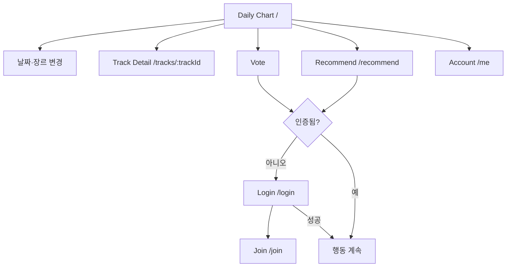
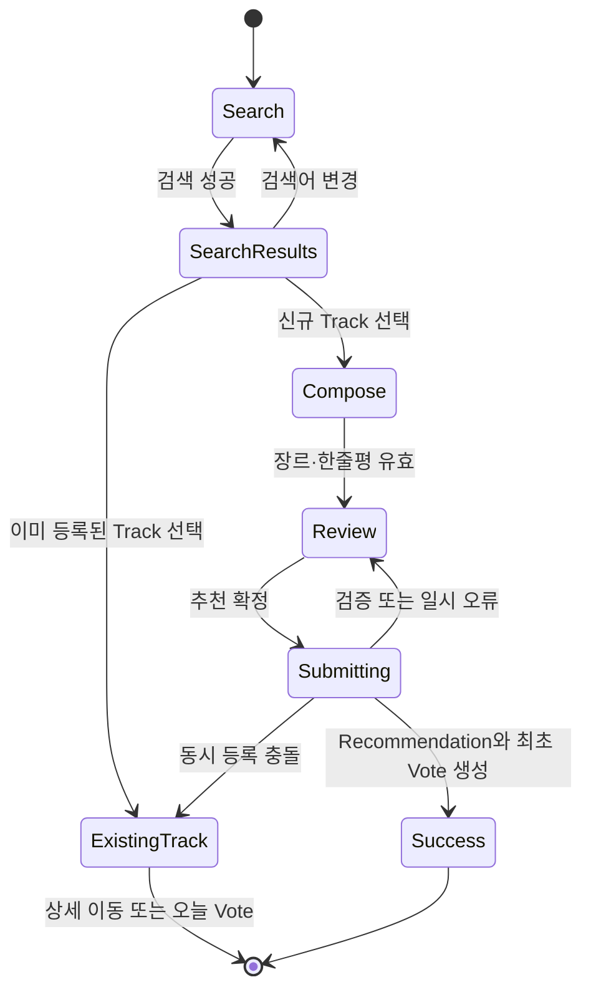

# Phase 2. 서비스 화면 및 상세 User Flow

> 상태: **Proposed**
>
> 기준 문서: `01-mvp-requirements-user-flow-domain.md`
>
> 임시 서비스명: **TrackDrop**

## 1. 문서 목적

Phase 1에서 승인한 MVP 정책을 사용자가 실제로 경험할 화면과 상호작용으로 변환한다. 이 문서는 시각 디자인 시안이 아니라 정보 구조, 화면별 책임, 이동 규칙, 상태와 오류 복구 방식을 정의한다.

구현 전에 이 문서를 확정하면 이후 ERD와 REST API가 실제 화면에 필요한 데이터와 행동을 빠뜨리지 않게 된다.

## 2. 이번 단계에서 결정해야 할 사항

1. 첫 화면과 전역 내비게이션의 구조
2. 비회원이 사용할 수 있는 범위와 로그인 유도 시점
3. 오늘 차트와 과거 차트를 한 화면에서 어떻게 구분할지
4. 신규 추천의 검색, 선택, 작성, 확정 단계를 어떻게 나눌지
5. 차트에서 투표와 미리듣기를 얼마나 빠르게 수행할 수 있게 할지
6. 일일 권한, 중복 투표, 외부 API 장애를 어떤 상태로 보여줄지
7. 모바일과 데스크톱에서 같은 흐름을 어떻게 유지할지

## 3. 추천 설계

### 3.1 UX 원칙

1. **차트 우선**: 첫 화면에서 오늘의 음악을 바로 탐색한다. 별도의 마케팅 랜딩 페이지는 두지 않는다.
2. **읽기는 공개, 쓰기는 인증**: 비회원도 차트 조회, 상세 확인, preview, 외부 링크를 사용할 수 있다. 투표와 신규 추천만 로그인이 필요하다.
3. **한 화면, 한 핵심 행동**: 차트에서는 탐색과 투표, 추천 화면에서는 검색과 등록에 집중한다.
4. **권한을 항상 예측 가능하게**: 로그인 사용자는 남은 일일 권한을 투표·추천 전에 확인할 수 있다.
5. **실패 후 맥락 보존**: 로그인이나 재시도가 필요해도 선택한 곡, 장르, 검색어, 돌아갈 위치를 가능한 한 유지한다.
6. **Preview는 선택 기능**: preview가 없어도 곡 카드와 추천 흐름은 완전하게 작동한다.
7. **오늘과 기록을 혼동하지 않게**: 오늘은 `LIVE`, 종료된 날짜는 `FINAL` 상태를 명시한다.

### 3.2 정보 구조

### 3.3 전역 내비게이션

데스크톱 헤더:

- 임시 워드마크 `TrackDrop`: 오늘 차트로 이동
- `Daily Chart`: 현재 날짜의 전체 차트로 이동
- `Recommend`: 신규 추천 흐름 시작
- 남은 권한 `3/5`: 인증 사용자에게만 표시
- 계정 메뉴 또는 `Login`

모바일 하단 내비게이션:

- Chart
- Recommend
- Me

현재 위치는 아이콘뿐 아니라 레이블과 선택 상태로 함께 표시한다. 모바일 상단에는 현재 화면 제목과 필요한 날짜/장르 컨트롤만 둔다.

### 3.4 Route 제안

| Route | 화면 | 접근 | 비고 |
| --- | --- | --- | --- |
| `/` | 오늘의 전체 Daily Chart | 공개 | 기본 진입점 |
| `/charts?date=YYYY-MM-DD&genre=slug` | 날짜·장르별 차트 | 공개 | 오늘은 live, 과거는 snapshot |
| `/tracks/{trackId}` | Track 상세 | 공개 | preview, 외부 링크, 한줄평, 투표 |
| `/recommend` | 신규 음악 추천 | 인증 | 미인증 시 로그인 후 복귀 |
| `/login` | 로그인 | 공개 | return URL과 pending intent 보존 |
| `/join` | 익명 계정 생성 | 공개 | 개인정보 미수집 안내 |
| `/me` | 계정 요약 | 인증 | 닉네임, 남은 권한, 로그아웃 |

`/charts`는 날짜와 장르를 URL query로 표현해 새로고침, 공유, 뒤로 가기에서도 같은 차트를 복원한다. 추천 작성 중 임시값은 URL에 노출하지 않고 세션 내 draft로 관리한다.

## 4. 설계 선택 이유

- 차트가 제품의 핵심 가치이므로 가입 설명보다 음악을 먼저 보여주는 편이 서비스 성격을 가장 빠르게 전달한다.
- 공개 탐색은 진입 장벽을 낮추고, 쓰기 시점 인증은 중복 투표와 일일 제한을 지킬 수 있게 한다.
- 오늘과 과거를 동일한 차트 화면에서 다루면 사용법이 단순해지면서 URL만으로 상태를 재현할 수 있다.
- 신규 추천은 외부 검색과 도메인 쓰기가 결합된 복잡한 흐름이므로 차트의 작은 modal보다 독립 페이지가 모바일, 오류 처리, 접근성에 유리하다.
- Track 상세는 차트 목록을 과밀하게 만들지 않으면서 한줄평, 외부 링크, 메타데이터를 충분히 제공한다.
- 로그인 후 자동으로 투표를 실행하지 않고 원래 화면으로 돌아와 한 번 더 명시적으로 누르게 하면 의도하지 않은 권한 소비를 막는다.

## 5. 대안과 Trade-off

| 대안 | 장점 | 단점 및 MVP 판단 |
| --- | --- | --- |
| 가입 전용 첫 화면 | 서비스 설명을 충분히 제공할 수 있다. | 음악 발견까지 한 단계가 늘어난다. 채택하지 않는다. |
| 모든 기능에 로그인 요구 | 권한 처리가 단순하다. | 차트를 보기 전 이탈 가능성이 크다. 읽기는 공개한다. |
| 추천 작성을 modal로 처리 | 현재 차트 맥락을 유지하기 쉽다. | 검색 결과, 오류, 키보드, 모바일 높이 처리가 복잡하다. 독립 페이지를 사용한다. |
| 장르별 별도 Route | 검색 엔진과 공유 링크가 명확하다. | 고정 장르가 늘수록 route 관리가 중복된다. query parameter를 사용한다. |
| 차트 카드에서 모든 정보 표시 | 상세 페이지 이동이 줄어든다. | 모바일 목록 밀도가 낮아지고 반복 탐색이 느려진다. 핵심 정보만 표시한다. |
| 로그인 후 pending Vote 자동 실행 | 클릭 수가 줄어든다. | 로그인 사이에 날짜나 권한 상태가 바뀔 수 있고 의도 확인이 없다. 원래 위치 복귀까지만 자동화한다. |
| 추천 흐름을 여러 Route로 분리 | 각 단계 URL을 공유할 수 있다. | 선택한 외부 검색 결과와 draft 복구가 복잡해진다. 한 Route 안의 단계로 처리한다. |

## 6. 화면 명세

### S-01. Daily Chart

목적: 사용자가 오늘 또는 선택한 과거 날짜의 음악을 전체/장르별 순위로 탐색한다.

핵심 콘텐츠:

- 날짜 컨트롤: 이전 날짜, 날짜 선택, 다음 날짜
- 상태 레이블: 오늘은 `LIVE`, 과거 확정 차트는 `FINAL`
- 장르 탭: ALL, Hip-Hop, R&B, Rock, Indie, Electronic, Jazz, K-Pop, J-Pop, Pop, Other
- 차트 갱신 기준 시각
- 순위 목록
- 로그인 사용자의 남은 일일 권한

오늘 이후 날짜는 선택할 수 없다. 과거 날짜에서 다음 버튼을 누를 때 오늘까지만 이동한다.

곡 행 또는 카드의 정보 우선순위:

1. 순위와 순위 변동 영역
2. 앨범 커버
3. 곡명과 아티스트
4. 대표 장르
5. 최초 추천자의 한줄평과 공개 닉네임
6. Vote 수와 Vote 행동
7. Preview 재생
8. 외부 전체 듣기 메뉴

MVP에는 전일 순위 비교 데이터가 없으므로 순위 변동 값은 표시하지 않는다. 레이아웃 공간만 미리 확보하지도 않는다.

행동:

- 장르 전환
- 날짜 전환
- preview 재생/일시정지
- Track 상세 열기
- 오늘 차트에서 Vote
- 외부 서비스에서 전체 듣기

과거 `FINAL` 차트에서는 당시 Vote 수와 순위를 조회만 한다. 과거 차트의 Vote 버튼은 비활성화하지 않고 `오늘 이 곡 추천하기`로 의미를 바꿔 오늘 날짜 Vote를 생성한다는 점을 확인시킨다.

상태:

| 상태 | 표시와 행동 |
| --- | --- |
| Loading | 목록의 안정된 크기를 유지하는 skeleton 표시 |
| Empty | 선택 날짜·장르에 확정된 곡이 없음을 알리고 오늘 차트 또는 추천으로 이동 제공 |
| Live | 오늘 날짜와 갱신 시각 표시, Vote 가능 |
| Final | 확정 차트임을 표시, snapshot 값은 변하지 않음 |
| Snapshot pending | 확정 처리 중임을 표시하고 실시간 값으로 대체하지 않음 |
| Error | 기존 화면 맥락을 유지하고 재시도 제공 |

반응형 구조:

- 데스크톱: 순위 목록을 조밀한 행 형태로 표시하고 주요 행동을 한 줄에 배치한다.
- 모바일: 앨범 커버와 곡 정보를 위쪽에, 한줄평과 행동을 아래쪽에 배치한다. 장르 탭은 가로 스크롤 가능하되 현재 탭이 보이게 한다.

### S-02. Track Detail

목적: 차트보다 넓은 맥락에서 곡을 확인하고 preview, Vote, 외부 듣기를 수행한다.

콘텐츠:

- 앨범 커버, 곡명, 아티스트, 앨범
- 대표 장르와 보조 장르
- 최초 추천자의 공개 닉네임, 한줄평, 추천 시각
- 오늘의 Vote 수와 사용자 Vote 상태
- preview player 또는 미제공 상태
- provider별 전체 듣기 링크
- 오늘 차트에서의 현재 전체/장르 순위가 있을 때만 표시

행동과 상태:

- 미인증 Vote는 로그인 후 해당 상세 화면으로 돌아온다.
- 이미 오늘 Vote한 곡은 완료 상태와 오늘은 다시 투표할 수 없다는 설명을 표시한다.
- 권한을 모두 사용한 경우 Vote 행동을 차단하고 다음 충전 시점을 서비스 시간대로 표시한다.
- 외부 링크가 하나만 있으면 해당 서비스 버튼을 바로 표시하고, 여러 개면 메뉴로 묶는다.

### S-03. Recommend

목적: 사용자가 외부 카탈로그에서 정확한 곡을 찾아 대표 장르와 한줄평으로 커뮤니티에 소개한다.

진입 조건:

- 인증 필요
- 남은 권한이 1회 이상이어야 최종 제출 가능
- 권한이 0이어도 검색과 작성은 허용하되 제출 불가 상태와 충전 시점을 처음부터 표시

단계:

#### Step 1. Search

- 곡명, 아티스트 또는 둘을 함께 입력
- 명시적 검색 버튼과 Enter 지원
- 최근 검색 기록은 MVP에서 저장하지 않음
- 최소 입력 길이와 검색 중 상태 표시

검색 결과 항목:

- 앨범 커버
- 곡명
- 아티스트
- 앨범명
- 발매 연도 또는 버전 식별 정보
- provider 출처
- 가능한 경우 짧은 preview

동명곡, 리마스터, 라이브 버전을 구분할 수 있는 정보를 우선한다.

#### Step 2. Compose

- 선택한 Track 요약
- 대표 장르 단일 선택
- 한줄평 1~120자
- 남은 글자 수
- 예상 권한: `추천하면 오늘 권한 1회를 사용합니다`

선택한 곡을 바꾸면 장르와 한줄평 draft는 유지하되 제출 전 새 곡에 맞는지 사용자가 다시 확인하도록 한다.

#### Step 3. Review and Submit

- Track, 대표 장르, 한줄평, 제출 후 남을 권한 표시
- 한 번의 명시적 확정 행동
- 제출 중 중복 클릭 방지
- 성공하면 Track 상세로 이동하고 오늘 첫 Vote가 포함됐음을 표시

동시성 충돌:

검색 당시에는 신규였지만 제출 직전에 다른 사용자가 같은 Track을 등록할 수 있다. 이 경우 두 번째 Recommendation을 만들지 않고 새로 생성된 기존 Track 상세로 연결하며, 사용자의 권한은 소비하지 않는다. 사용자가 원하면 그 Track에 별도 Vote를 수행한다.

외부 API 장애:

- timeout과 provider 오류를 구분할 필요는 없지만 재시도 가능 여부를 명확히 표시한다.
- 검색 결과가 이미 화면에 있어도 최종 제출 검증이 실패하면 draft를 유지한다.
- provider 비밀키나 원본 오류 응답은 노출하지 않는다.

### S-04. Login

목적: 개인정보를 노출하지 않는 기존 계정으로 로그인한다.

필드와 행동:

- 로그인 ID
- 비밀번호 표시 전환
- 로그인
- 익명 계정 만들기

정책:

- 오류는 `로그인 정보를 확인해 주세요`로 통일한다.
- 로그인 성공 후 안전한 내부 return URL로 복귀한다.
- pending intent는 자동 실행하지 않고 대상 곡과 수행하려던 행동을 다시 보여준다.
- 이미 로그인한 사용자가 접근하면 원래 목적지 또는 오늘 차트로 이동한다.

### S-05. Join

목적: 개인정보 없이 다시 로그인 가능한 익명 계정을 만든다.

필드와 콘텐츠:

- 로그인 ID
- 비밀번호
- 비밀번호 확인
- 자동 생성될 공개 닉네임에 대한 짧은 설명
- 이메일을 받지 않아 계정 복구가 지원되지 않는다는 제출 전 안내

성공 상태:

- 생성된 공개 닉네임 표시
- 자격 증명 보관 필요성 안내
- 가입 전에 시작한 안전한 내부 흐름으로 복귀

실패 상태:

- 로그인 ID 중복
- 비밀번호 정책 불충족
- 닉네임 생성 충돌은 서버에서 재시도하고 일반 오류로 노출하지 않음

### S-06. Account

목적: 익명 Identity와 오늘의 사용 가능 상태를 확인한다.

MVP 콘텐츠:

- 공개 닉네임
- 오늘 사용한 권한과 남은 권한
- 다음 권한 갱신 시각
- 계정 생성일
- 로그아웃

닉네임 변경, 추천 이력, Taste Profile, 계정 복구는 표시하지 않는다. 준비 중인 기능을 빈 메뉴로 노출하지 않는다.

## 7. 상세 User Flow

### UF-01. 비회원이 차트를 듣고 가입 후 Vote

1. 사용자가 `/`에서 오늘 전체 차트를 본다.
2. 장르를 변경하고 Track preview를 재생한다.
3. Vote를 선택한다.
4. 시스템은 로그인 필요 상태와 선택한 Track을 표시한다.
5. 사용자는 로그인하거나 익명 계정을 만든다.
6. 시스템은 원래 Track과 스크롤 위치로 복귀한다.
7. 사용자는 Vote를 다시 확인한다.
8. 성공 시 Vote 수, 사용자 상태, 남은 권한을 함께 갱신한다.

복구 규칙:

- 인증 중 해당 Track이 비활성화되면 자동 Vote하지 않고 이용 불가 상태를 표시한다.
- 날짜가 바뀌면 새 날짜의 Vote임을 확인시킨다.
- 중복 Vote 응답은 UI를 이미 투표한 상태로 동기화한다.

### UF-02. 로그인 사용자의 빠른 Vote

1. 사용자가 오늘 차트의 Vote 행동을 선택한다.
2. 클라이언트는 해당 버튼에 제출 중 상태를 표시한다.
3. 서버가 인증, 날짜, 중복, 일일 한도를 검증한다.
4. 성공 응답의 Vote 수와 남은 권한으로 화면 상태를 교체한다.
5. 실패 시 낙관적으로 수치를 올리지 않고 서버 상태에 맞춰 복구한다.

한 사용자의 여러 탭에서 동시에 Vote해도 각 응답의 서버 기준 남은 권한을 사용한다. 클라이언트의 로컬 카운터는 권한 판단의 근거가 아니다.

### UF-03. 신규 곡 추천 성공

1. 사용자가 `Recommend`에 진입한다.
2. 곡명과 아티스트로 외부 카탈로그를 검색한다.
3. 앨범과 버전을 확인해 정확한 결과를 선택한다.
4. 대표 장르와 한줄평을 작성한다.
5. 검토 화면에서 곡과 소비될 권한을 확인한다.
6. 서버가 provider 정보 재검증, Track 정규화, 중복 검사, 한도 검사를 수행한다.
7. Track, Recommendation, 최초 Vote를 필요한 범위에서 원자적으로 저장한다.
8. 성공한 Track 상세로 이동하고 남은 권한을 갱신한다.

### UF-04. 이미 등록된 곡 추천 시도

1. 사용자가 검색 결과에서 이미 등록된 Track을 선택한다.
2. 시스템은 최초 추천자의 한줄평과 오늘 Vote 상태를 보여준다.
3. 사용자는 신규 글을 만들지 않고 Track 상세로 이동한다.
4. 오늘 아직 Vote하지 않았고 권한이 남았다면 Vote할 수 있다.

### UF-05. 일일 권한 소진

1. 마지막 사용 가능한 Vote 또는 Recommendation이 성공한다.
2. 전역 권한 표시가 `0/5`로 갱신된다.
3. Vote와 추천 제출 행동은 비활성 상태가 된다.
4. 시스템은 다음 권한 갱신 시각을 표시한다.
5. 차트 탐색, preview, 외부 듣기, 추천 draft 작성은 계속 가능하다.

### UF-06. 과거 차트 탐색

1. 사용자가 날짜 컨트롤에서 과거 날짜를 선택한다.
2. 시스템은 URL query를 변경하고 해당 날짜 snapshot을 조회한다.
3. `FINAL` 상태와 확정 당시 득표 수를 표시한다.
4. 장르 변경 시 같은 날짜를 유지한다.
5. 과거 곡에 Vote하면 오늘 날짜에 반영된다는 점을 행동 문구로 구분한다.

## 8. 공통 상태와 메시지 정책

| 상황 | 사용자에게 전달할 의미 | 복구 행동 |
| --- | --- | --- |
| 미인증 | 참여하려면 익명 계정 인증이 필요함 | Login / Join |
| 일일 한도 소진 | 오늘 5회를 모두 사용함 | 갱신 시각 확인, 탐색 계속 |
| 당일 중복 Vote | 이미 오늘 추천한 곡임 | 완료 상태로 동기화 |
| Track 동시 등록 충돌 | 다른 사용자가 먼저 소개함 | 기존 Track 보기, Vote 선택 |
| 외부 검색 장애 | 음악 검색을 일시적으로 사용할 수 없음 | draft 유지, 다시 시도 |
| Preview 없음 | 공식 미리듣기가 제공되지 않음 | 외부 전체 듣기 |
| Snapshot 생성 중 | 과거 순위를 아직 확정하는 중 | 잠시 후 다시 시도 |
| 일반 네트워크 오류 | 요청 결과를 확인하지 못함 | 중복 제출 없이 상태 재조회 |

오류 메시지는 기술 원인보다 사용자가 다음에 할 수 있는 행동을 우선한다. 성공 toast만으로 중요한 상태를 전달하지 않고 버튼 상태, Vote 수, 남은 권한에도 결과를 반영한다.

## 9. 반응형 및 접근성 기준

### 반응형

- 360px 이상에서 핵심 기능이 가로 스크롤 없이 동작한다. 장르 탭 자체의 의도된 가로 스크롤은 허용한다.
- 차트 순위, 커버, 제목, Vote 행동의 위치가 곡마다 크게 흔들리지 않도록 고정된 grid 영역을 사용한다.
- 모바일에서 주요 touch target은 최소 44px 높이를 확보한다.
- 긴 곡명과 아티스트명은 최대 줄 수를 정하고 전체 값은 상세 화면에서 제공한다.
- preview 상태 변화가 카드 높이를 바꾸지 않게 player 영역 크기를 고정한다.

### 접근성

- 모든 입력에 영구적으로 보이는 label을 제공한다.
- 키보드로 장르 선택, 날짜 이동, Vote, preview 제어, 외부 링크 접근이 가능해야 한다.
- 재생/일시정지와 Vote 완료 상태는 아이콘, 텍스트, 접근성 이름으로 함께 전달한다.
- `LIVE`, `FINAL`, 오류, 한도 상태를 색상만으로 구분하지 않는다.
- 비동기 검색 결과와 Vote 결과는 보조기기에 알릴 수 있는 상태 영역을 사용한다.
- 자동 재생은 사용하지 않는다.

## 10. 화면과 도메인/API 입력 관계

| 화면 요구 | 필요한 도메인 또는 API 정보 |
| --- | --- |
| 전역 남은 권한 | 현재 사용자, 서비스 날짜, limit, used, remaining, resetAt |
| 오늘 차트 | scope, genre, live vote count, 사용자별 voted 여부, updatedAt |
| 과거 차트 | ranking date, final rank, final vote count, snapshot status |
| Track 카드 | Track 요약, Recommendation 한줄평/닉네임, 대표 Genre, preview, provider links |
| 외부 검색 결과 | provider, externalTrackId, ISRC, 곡/앨범/아티스트, 버전 식별 정보 |
| 추천 제출 | 선택한 provider 식별자, 대표 genreId, comment |
| Vote 제출 | 내부 trackId만 전송. userId와 votedOn은 서버가 결정 |
| 로그인 복귀 | 검증된 내부 return URL, pending intent의 비민감 식별 정보 |

## 11. 이후 구현에 미치는 영향

- Phase 3 ERD에는 사용자별 `voted 여부`를 효율적으로 조회할 인덱스와 일일 권한 상태가 필요하다.
- 차트 API는 Track, Recommendation 요약, preview, provider link, 사용자별 상태를 한 화면에 맞는 projection으로 제공해야 한다.
- 인증은 안전한 return URL을 지원해야 하며, 클라이언트가 임의 외부 URL로 redirect시키지 못하게 해야 한다.
- 추천 API는 검색 결과 원문 전체를 신뢰하지 않고 provider 식별자로 재검증해야 한다.
- 동시 Track 등록 충돌은 일반 서버 오류가 아니라 기존 Track으로 전환 가능한 도메인 결과로 설계해야 한다.
- snapshot 생성 상태를 보여주려면 `RankingRun`의 공개 가능한 상태 조회가 필요하다.
- 프론트엔드는 Vote 수와 권한을 임의 계산하지 않고 쓰기 응답 또는 재조회 결과를 기준으로 갱신해야 한다.

## 12. Phase 3 전에 확정할 정책

1. 임시 서비스명 `TrackDrop`을 계속 사용할지 여부
2. 로그인 ID를 사용자가 정할지 시스템이 발급할지 여부
3. 일일 권한 표기 방식: `남은 3회` 또는 `3/5`
4. 과거 차트에서 Vote 행동을 직접 허용할지 상세 화면을 거치게 할지 여부
5. 초기 장르 목록과 정렬 순서
6. 동률 표시를 공동 순위로 할지 고정 순번으로 할지 여부

## 13. Phase 2 완료 조건

- 모든 MVP 기능이 진입 가능한 화면 또는 명시적인 백그라운드 흐름에 연결된다.
- 공개 탐색과 인증이 필요한 행동의 경계가 정의된다.
- 신규 추천, 기존 곡 Vote, 로그인 복귀, 과거 차트의 정상·실패 흐름이 정의된다.
- 모바일과 데스크톱의 내비게이션 원칙이 정리된다.
- 화면에 필요한 데이터가 다음 ERD와 API 설계 입력으로 추출된다.
